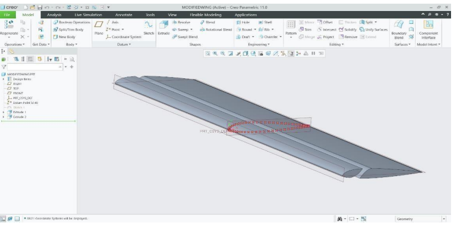
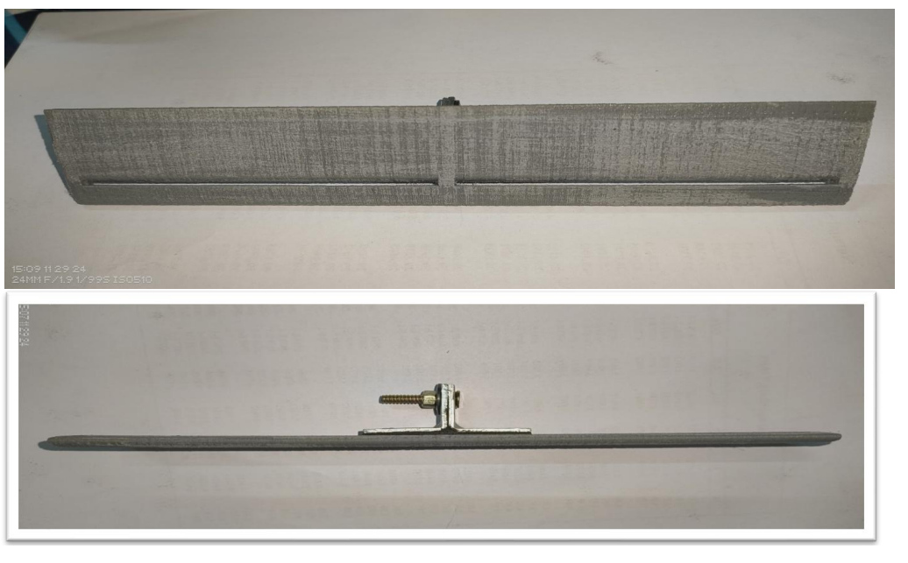
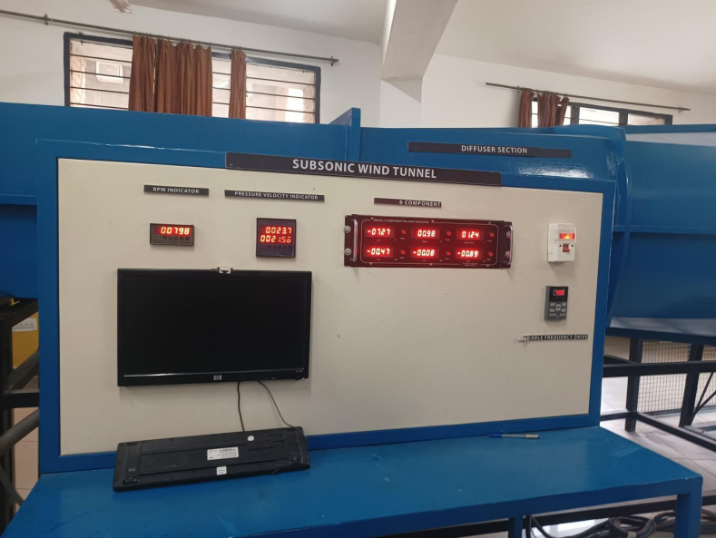
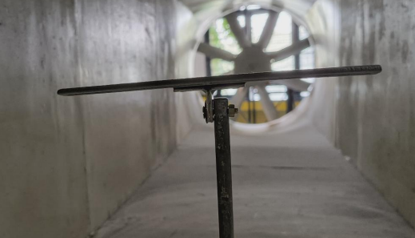

# Slotted NACA 23012 Airfoil Design, Fabrication and Wind Tunnel Testing

Experimental investigation of a slotted NACA 23012 airfoil including CAD design, 3D printing fabrication, Reynolds number scaling analysis, and subsonic wind tunnel testing for aerodynamic performance evaluation.

---

## Project Overview

High-lift devices are critical components in aircraft aerodynamic design. Slotted airfoils improve aerodynamic performance by delaying flow separation and increasing lift generation at higher angles of attack.

This project involved:

- Designing a slotted NACA 23012 airfoil
- Creating a CAD model using Creo
- Fabricating the airfoil using 3D printing
- Conducting subsonic wind tunnel experiments
- Measuring aerodynamic forces
- Evaluating lift and drag characteristics

---

## Objectives

- Design a slotted NACA 23012 airfoil
- Fabricate a test-ready aerodynamic model
- Perform wind tunnel testing
- Measure lift and drag characteristics
- Evaluate aerodynamic performance

---

## CAD Model

The slotted airfoil geometry was developed using Creo Parametric and optimized for experimental testing.

---

## Fabricated Airfoil

The airfoil was manufactured using 3D printing technology and finished to improve surface quality before testing.

---

## Wind Tunnel Facility

Testing was conducted in a subsonic wind tunnel facility.

---

## Wind Tunnel Testing

The fabricated airfoil was mounted inside the test section and evaluated under controlled airflow conditions.

---

## Experimental Parameters

| Parameter | Value |
|------------|----------|
| Airfoil | NACA 23012 |
| Type | Slotted Airfoil |
| Wind Speed | 21.56 m/s |
| Reynolds Number | 327,000 |
| Frequency | 40 Hz |
| RPM | 798 |
| Angle of Attack | 0°–5° |

---

## Sample Experimental Results

| Parameter | Value |
|------------|----------|
| Lift | 7.27 N |
| Drag | 0.98 N |
| Side Force | 1.24 N |
| Pitching Moment | 0.08 Nm |
| Rolling Moment | 0.89 Nm |
| Yawing Moment | 0.47 Nm |

---

## Key Findings

- Slotted airfoil delayed flow separation.
- Lift generation improved compared to conventional configurations.
- Aerodynamic stability improved during testing.
- Fabrication accuracy contributed to reliable experimental results.
- Wind tunnel testing validated aerodynamic performance.

---

## Skills Demonstrated

- Aerodynamics
- Wind Tunnel Testing
- Airfoil Design
- Experimental Analysis
- Aerospace Engineering
- CAD Modeling
- Creo Parametric
- 3D Printing
- Data Analysis

---

## Project Report

Complete project documentation:

[Slotted Airfoil Report](report/slotted-airfoil-report.pdf)

---

## Authors

Laxmipriya Murmu  
B.Tech Aerospace Engineering  
Lovely Professional University

Project Team:

- Laxmipriya Murmu
- Gowtham Kumar Chukka
- Gowtham Kumar Talla
- Mounish Damera

Faculty Guide:

- Dr. Balaji Ravi
